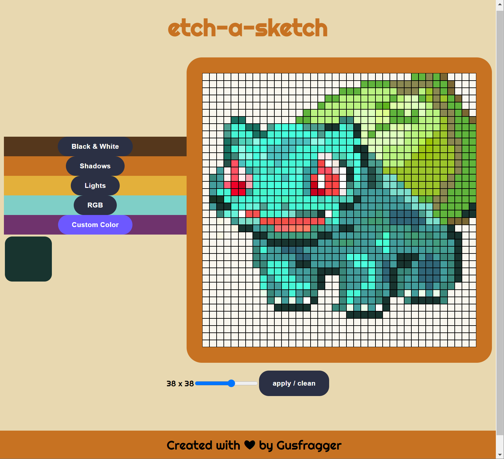
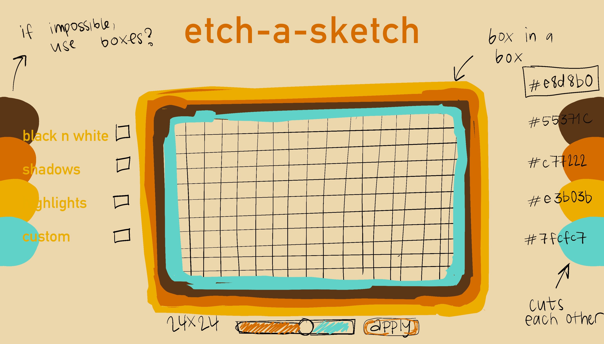

#Etch-a-Sketch 🎨
Etch-a-Sketch is a simple drawing board that allows users to draw by moving their mouse over the cells on the board. The board can be resized using the range slider and the user can select the drawing mode using the buttons.

##Features 🔥
*Black and White mode: solid black color with an alpha channel value of FF (fully opaque).
*RGB mode: random color with a random alpha channel value.
*Shadows mode: increases the alpha channel value of the current cell color.
*Lights mode: decreses the alpha channel value of the current cell color.
*Custom Color mode: allows the user to select a custom color using a color picker.

##How to Use 💻
1.Open the index.html file in your browser.
2.Use the range slider to adjust the size of the board.
3.Click the "APPLY" button to create a new board with the selected size.
4.Select the drawing mode using the buttons.
5.Use your mouse to draw on the board.

##Starting from a Mockup 🎨
I started this project from a moodboard to get an idea of what I wanted, opted for this 70's inspired theme.

##Live Preview 🔥
You can try a live preview of this project at the following 
link: LIVE PREVIEW

##Future Features 🔮
*Allow users to download their drawings as pixel art or as icons.

##Technologies Used 💻
*HTML
*CSS
*JavaScript

##Credits 🙏
This project was created by Gus Pereira.

##License 📜
This project is licensed under the MIT License. See the LICENSE file for details.

